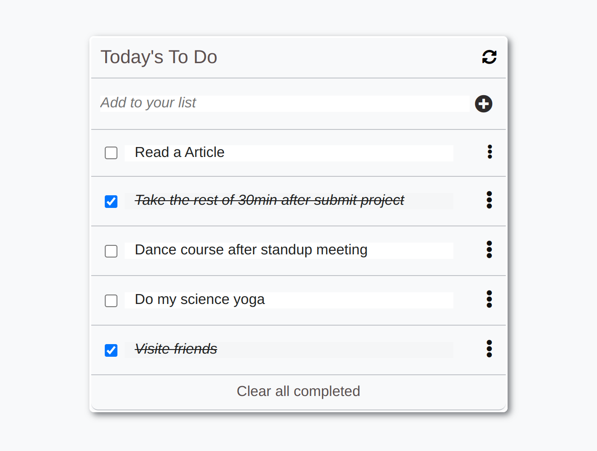

# Todo_List

## Description

> "To-do list" is a tool that helps to organize your day. It simply lists the things that you need to do and allows you to mark them as complete.

## Built With

- HTML
- CSS
- JavaScript

## Get Started

To get a local copy up and running follow these simple example steps.

1. Clone the Repo or Download the Zip file or `https://github.com/cynthiainga/to-do-list-app.git`.
2. `cd /to-do-list-app`
3. Open it with the live server by using this command: `npm run build` or `npm start`

## Test

For tracking linter errors locally you need to follow these steps:

After cloning the project you need to run these commands

`npm install` `This command will download all the dependancies of the project`

For tracking linter errors in HTML files run:

`npx hint .`

For tracking linter errors in CSS or SASS files run:

`npx stylelint "\*_/_.{css,scss}"`

And For tracking linter errors in JavaScript files run:

`npx eslint .`

## Live Demo

See the [Live Demo](https://cynthiainga.github.io/to-do-list-app/dist)

## Author

👤 **Cynthia Inga Candy**

- GitHub: [@cynthiainga](https://github.com/cynthiainga)
- Twitter: [@CynthiaInga_C](https://twitter.com/CynthiaInga_C)
- LinkedIn: [Cynthia Inga](https://www.linkedin.com/in/cynthia-inga/)

## 🤝 Contributing

Contributions, issues, and feature requests are welcome!

Feel free to check the [issues page](../../issues/).

## Show your support

Give a ⭐️ if you like this project!

## Acknowledgments

- Thanks to everyone who will get time to check this code and sugest any [issue](https://github.com/cynthiainga/todo-list-app/issues) to improve the page.
- Hat tip to [Microvers](www.microverse.org) and all the staff
- Thanks to My coding Partners
- Thanks to My Morning-session-group and Standup-team Partners and
- Thanks to Code Reviewers

## 📝 License

This project is [MIT](./MIT.md) licensed.
